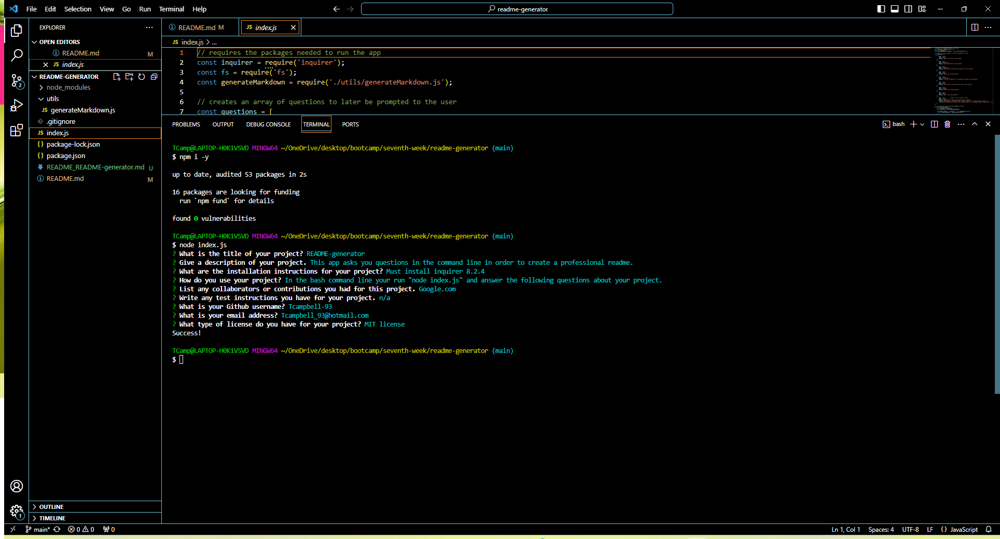

# readme-generator

## Description
This is a README generator I created to be used with nodeJs. I created this in order to learn more about nodeJs and backend programming. I also learned about switch functions and importing/exporting js files.

## Installation 
You must install inquirer version 8.2.4

## Usage
Open using the bash command 'node index.js'. It will prompt you with several questions about a project you are working on and generate a professional README file.

## Contributors
Google.com 
canvas xpert learning assistant

https://drive.google.com/file/d/1E9gciRVVZglKPfdf48P8LA1wrWcMysNe/view
